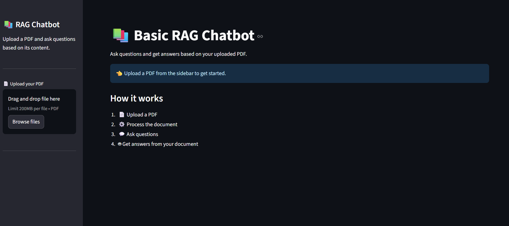

# 📚 Basic RAG Chatbot

An interactive **Retrieval-Augmented Generation (RAG)** chatbot built with **Streamlit**, **LangChain**, and **ChromaDB**, powered by **Groq** LLMs and **HuggingFace** embeddings.

The application allows users to upload PDF documents, process their content, and ask questions. Answers are generated using relevant information retrieved from the uploaded document.

---

## 🚀 Features

- 📄 **PDF Upload** — Upload PDF documents directly through the Streamlit interface.
- ✂️ **Smart Text Chunking** — Splits documents into smaller chunks using `RecursiveCharacterTextSplitter`.
- 🧠 **Local Embeddings** — Generates embeddings using `sentence-transformers/all-MiniLM-L6-v2`.
- 🗄️ **Vector Search** — Stores document embeddings in ChromaDB for similarity search.
- 🔍 **Context-Aware Retrieval** — Retrieves the most relevant document chunks for each question.
- 🤖 **LLM-Powered Answers** — Uses Groq's `llama-3.1-8b-instant` model to generate answers.
- 💬 **Chat Interface** — Interactive Streamlit chat interface with conversation history.
- 🧹 **Clear Chat** — Easily reset the current conversation.
- 🔒 **Document-Grounded Responses** — The chatbot is instructed to answer using the uploaded document context.

---

## 🛠️ Tech Stack

| Technology | Purpose |
|---|---|
| **Python** | Core programming language |
| **Streamlit** | Web interface |
| **LangChain** | LLM and RAG orchestration |
| **ChromaDB** | Vector storage and similarity search |
| **HuggingFace** | Text embeddings |
| **Groq** | LLM inference |
| **PyPDF** | PDF document loading |

### Models

- **LLM:** `llama-3.1-8b-instant`
- **Embedding Model:** `sentence-transformers/all-MiniLM-L6-v2`

---

## 📂 Project Structure

```text
basic_rag_chatbot/
│
├── app.py                  # Streamlit user interface
├── rag_pipeline.py         # PDF processing and RAG pipeline
├── prompts.py              # RAG prompt template
├── requirements.txt        # Project dependencies
├── .env                    # Environment variables
└── .gitignore              # Ignored files

## 🖼️ Application Preview

